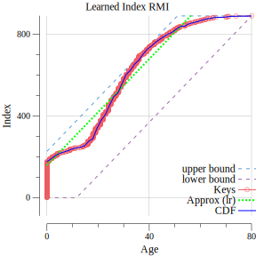

RMI
===

A goland implementation of a RMI ([Recursive Model Indexes](https://github.com/learnedsystems/RMI)), 
a Learned Index structure based on the [research work by Kraska & al.](https://arxiv.org/abs/1712.01208) 

## usage

Create an index and make lookups

	// load the age column and parse values into float64 values
	ageColumn := extractAgeColumn("data/people.csv")

	// create an index over the age column
	index := index.New(ageColumn)

	// search an age and get back its line position inside the file people.csv
	search, _ := strconv.ParseFloat(os.Args[1], 64)
	lines, _ := index.Lookup(search)

the `main.go` file contains an example of a learned index over`data/people.csv` age column. 

It outputs : 

	$ cat data/people.csv
	name,age,sex
	jeanne,90,F
	jean,23,M
	Carlos,3,M
	Carlotta,45,F
	Miguel,1,M
	Martine,1.5,F
	Georgette,23,F

    $ go run main.go 45
	2020/11/15 20:29:56 People who are 23 years old are located at [8 3] inside data/people.csv 

This is the plot showing the approximation (the linear regression), the cumulative distribution function for each value,
and the current age's value (the Keys of the index) : 

## features

- [x] A simple linear regression model learning the CDF of a float64 array
- [x] A learned index structure fitted on keys of a collection
- [x] Finding rows id on a CSV file
- [x] Return a list of lines matching the key
- [x] Use max + min error bounding elements to search quickly
- [x] Benchmarks InMemory LearnedIndex against InMem BinarySearch
- [ ] Store offset lines and a primary key index
- [ ] Store the sortedTable
- [ ] Benchmarks Learned against BinarySearchTree
- [ ] A two layer recursive index
- [ ] Learn on integer
- [ ] Index is persistent and durable (on hard drive)
- [ ] A sort algorythm using learned structure
- [ ] Learning on string type ?

## related works

* Tim Kraska, Alex Beutel, Ed H. Chi, Jeffrey Dean, and Neoklis Polyzotis. 2018. The Case for Learned Index Structures. In Proceedings of the 2018 International Conference on Management of Data (SIGMOD '18). Association for Computing Machinery, New York, NY, USA, 489–504. DOI:https://doi.org/10.1145/3183713.3196909

* [Ryan Marcus RMI's reference implementation](https://github.com/learnedsystems/RMI)
